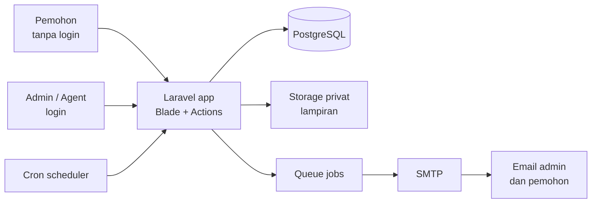
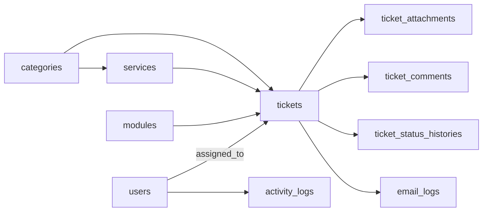
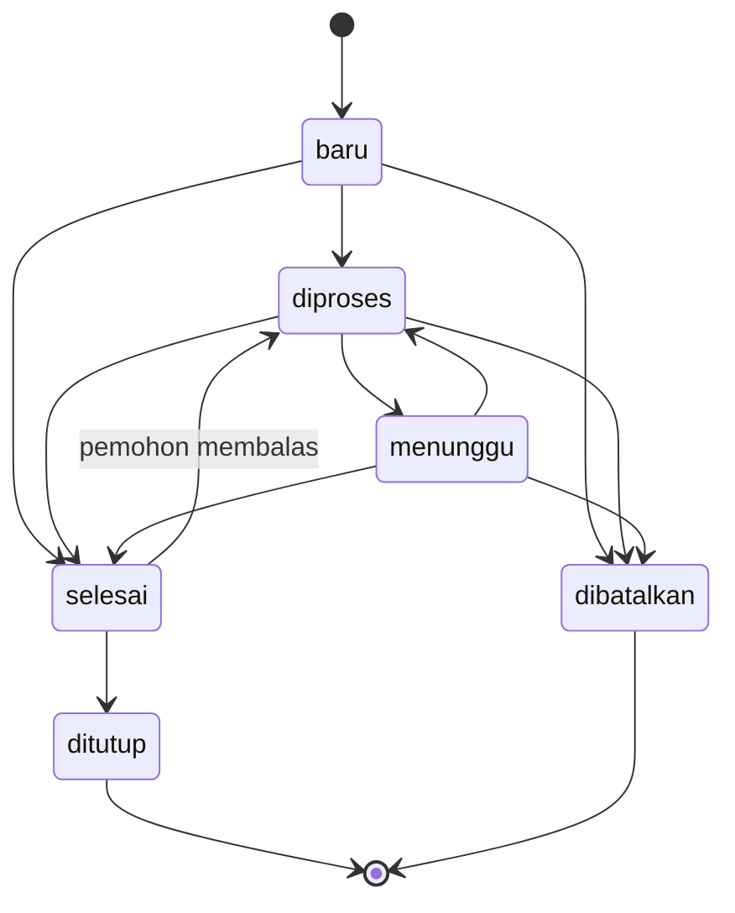

# PRD IT Helpdesk Alita

Versi 24 September 2026. Sumber asli: Claude Doc "PRD IT Helpdesk Alita". Jika ada perubahan di doc, ekspor ulang ke file ini.

## Ringkasan dan cara pakai

IT Helpdesk Alita adalah aplikasi web Laravel untuk melapor kendala IT, memantau antrian secara transparan, dan mengelola tiket oleh tim IT. Pemohon tidak perlu login; tim IT login ke panel admin.

Tujuan produk:

- Semua karyawan bisa melapor kendala IT dalam waktu kurang dari 2 menit, dari HP maupun laptop.
- Tim IT (Rio dan agent) langsung menerima email untuk setiap tiket baru.
- Pemohon dan admin sama-sama bisa melihat posisi antrian, status, dan riwayat tiket.
- Setiap aksi tercatat di audit log, dan setiap email tercatat di email log.

### Cara memakai PRD ini dengan agent

1. Ekstrak paket `alita-helpdesk-agent-kit.zip` ke root project Laravel. Isinya: `CLAUDE.md`, `SETUP.md`, `.env.example` (PostgreSQL), `_referensi/tahap1/`, `docs/PRD.md` (dokumen ini), `docs/FRONTEND_RULES.md`, `docs/BACKEND_RULES.md`, `docs/PROMPTS.md`, skill proyek di `.claude/skills/`, dan `public/css/tokens.css`.
2. Pasang skill ponytail dan taste-skill di Claude Code (perintahnya ada di `CLAUDE.md`).
3. Beri perintah ke agent per milestone memakai prompt siap pakai di `docs/PROMPTS.md`.
4. Setelah setiap milestone selesai, cek acceptance criteria di bagian Testing sebelum lanjut.

Kalau kode Tahap 1 (`helpdesk-it.zip`) sudah ada di repo, agent melanjutkan dari kode itu dan menyesuaikannya dengan PRD ini. Kalau ada perbedaan, PRD ini yang berlaku.

## Peran dan autentikasi

Sisi pemohon sengaja tanpa login, sedangkan panel admin wajib login. Alasannya: orang yang melapor sering sedang bermasalah dengan laptop, email, atau akunnya sendiri, jadi mereka tidak boleh terhalang login.

| Peran | Login | Akses |
| --- | --- | --- |
| Pemohon | Tidak | Kirim tiket, lihat papan antrian, buka halaman tracking lewat link di email, balas dan batalkan tiketnya sendiri |
| Agent IT | Ya | Lihat dan kerjakan semua tiket, ubah status dan prioritas, ambil tiket, komentar publik dan internal |
| Admin | Ya | Semua hak agent, plus assign ke siapa pun, kelola master data, kelola user, lihat audit log dan email log |

### Bagaimana sisi publik tetap aman tanpa login

- **Link tracking = bukti kepemilikan.** Setiap pemohon menerima signed URL di emailnya. Link ini tidak bisa ditebak atau diubah; mengganti nomor tiket di URL akan ditolak (403).
- **Lupa link tidak masalah.** Halaman `/lacak` meminta nomor tiket + email. Kalau cocok, sistem mengirim ulang link ke email tersebut. Pesan di layar selalu sama, cocok atau tidak, supaya orang tidak bisa mengecek data milik orang lain.
- **Papan antrian dianonimkan.** Hanya menampilkan nomor tiket, kategori, layanan/modul, status, dan waktu. Nama, email, dan deskripsi tidak pernah tampil.
- **Anti spam.** Rate limit per IP, honeypot, dan pencegahan double submit.
- **Opsional:** batasi email pemohon hanya domain tertentu lewat `HELPDESK_ALLOWED_EMAIL_DOMAINS=alita.id` (kosong = semua domain boleh).

### Autentikasi panel admin

- Pakai session auth bawaan Laravel dengan controller sendiri (tanpa Breeze/Jetstream) supaya tampilannya konsisten dengan CSS proyek.
- Tidak ada halaman register publik. User dibuat oleh admin di panel, atau lewat perintah `php artisan helpdesk:make-admin` untuk admin pertama (password diketik interaktif, tidak disimpan di `.env`).
- Fitur: login dengan "ingat saya", logout, lupa password via email (password broker Laravel), ganti password sendiri.
- Login dibatasi 5 percobaan per menit per kombinasi email + IP.
- Session di-regenerate setelah login; logout meng-invalidate session dan token CSRF.
- User dengan `is_active = false` tidak bisa login dan session aktifnya ditolak oleh middleware.
- Kolom `role` bernilai `admin` atau `agent`, dicek lewat middleware `role:admin` dan Policy.

### Matriks hak akses

| Aksi | Agent | Admin |
| --- | --- | --- |
| Lihat daftar dan detail tiket | Ya | Ya |
| Ubah status dan prioritas | Ya | Ya |
| Ambil tiket (assign ke diri sendiri) | Ya | Ya |
| Assign ke orang lain | Tidak | Ya |
| Komentar publik dan internal | Ya | Ya |
| Unduh lampiran | Ya | Ya |
| Hapus tiket (soft delete) | Tidak | Ya |
| Kelola layanan dan modul | Tidak | Ya |
| Kelola user | Tidak | Ya |
| Lihat audit log dan email log, kirim ulang email gagal | Tidak | Ya |

## Tech stack dan konvensi clean code

Stack dipilih agar bisa jalan di server kantor biasa tanpa build step frontend.

| Komponen | Pilihan |
| --- | --- |
| Bahasa | PHP 8.4+ dengan `declare(strict_types=1);` di setiap file PHP baru |
| Framework | Laravel 12 (boleh 11) |
| Database | PostgreSQL 16 (minimal 15) |
| Tampilan | Blade + CSS custom (`public/css`) + JavaScript vanilla (`public/js`), tanpa Vite/npm |
| Font | Plus Jakarta Sans (Google Fonts) dengan fallback system-ui |
| Queue | Driver `database`, worker dijalankan systemd (lihat DEPLOY.md) |
| Email | SMTP (Microsoft 365 / Google Workspace / server mail kantor) |
| Scheduler | `php artisan schedule:run` via cron tiap menit |
| Test | PHPUnit feature test bawaan Laravel, database PostgreSQL terpisah `alita_helpdesk_test` agar perilakunya sama dengan production |
| Kualitas kode | Laravel Pint (preset `laravel`), Larastan level 6 |
| Bahasa UI | Indonesia, `APP_LOCALE=id`, pesan validasi di `lang/id/validation.php` |
| Zona waktu | `APP_TIMEZONE=Asia/Jakarta` |

### Aturan clean code (wajib diikuti agent)

1. **Controller tipis.** Controller hanya menerima request, memanggil Action, dan mengembalikan response. Maksimal sekitar 15 baris per method.
2. **Validasi di Form Request**, tidak pernah di controller.
3. **Logika bisnis di Action class** (`app/Actions/Tickets/CreateTicket.php`, `ChangeTicketStatus.php`, dan seterusnya). Satu class, satu tugas, satu method publik `handle()`.
4. **Otorisasi lewat Policy** (`TicketPolicy`, `UserPolicy`) dan middleware `role`, tidak ada cek `if ($user->role === ...)` tersebar di controller.
5. **Enum PHP** untuk nilai tetap: `TicketStatus`, `TicketPriority`, `UserRole`, `AuthorType`, `EmailStatus`.
6. **Tidak ada query di Blade.** Semua data disiapkan di controller atau View Composer, dengan eager loading.
7. **Cegah N+1:** aktifkan `Model::preventLazyLoading(! app()->isProduction())` di `AppServiceProvider`.
8. **Tanpa angka/teks ajaib:** batas upload, SLA, jumlah hari auto-close, email admin, semuanya di `config/helpdesk.php` yang membaca `.env`.
9. **Penamaan:** kode, tabel, dan kolom dalam bahasa Inggris; teks yang dilihat user dalam bahasa Indonesia; nilai enum status dalam bahasa Indonesia (`baru`, `diproses`, dan seterusnya) karena tampil di laporan.
10. **Transaksi database** untuk operasi yang menulis ke lebih dari satu tabel.
11. **Event setelah commit:** email dan log yang bergantung pada data baru dikirim setelah transaksi berhasil (`afterCommit`).
12. **Blade component** untuk elemen berulang: `<x-status-badge>`, `<x-field>`, `<x-timeline>`, `<x-stat-card>`, `<x-empty-state>`.
13. **Setiap fitur punya feature test** sebelum milestone dianggap selesai.
14. Jalankan `./vendor/bin/pint` dan `./vendor/bin/phpstan analyse` tanpa error sebelum menutup milestone.

Detail aturan backend ada di `docs/BACKEND_RULES.md`.

## Arsitektur dan struktur folder

Satu aplikasi Laravel melayani halaman publik dan panel admin; email dikirim terpisah oleh queue worker.



Request publik dan admin melewati validasi, CSRF, dan rate limit yang sama; hanya route `/admin` yang memerlukan login.

### Struktur folder

```text
app/
  Actions/Tickets/        CreateTicket, ChangeTicketStatus, AssignTicket, ChangePriority,
                          AddComment, CancelTicketByRequester, SendTrackingLink, AutoCloseResolvedTickets
  Actions/Users/          CreateUser, UpdateUser, ToggleUserActive
  Console/Commands/       MakeAdminCommand (helpdesk:make-admin), AutoCloseTicketsCommand
  Enums/                  TicketStatus, TicketPriority, UserRole, AuthorType, EmailStatus
  Http/Controllers/       TicketController, QueueBoardController, TrackingController, AttachmentController
  Http/Controllers/Auth/  LoginController, PasswordResetController, PasswordController
  Http/Controllers/Admin/ DashboardController, TicketController, TicketStatusController,
                          TicketAssignmentController, TicketCommentController, ServiceController,
                          ModuleController, UserController, ActivityLogController, EmailLogController
  Http/Middleware/        EnsureUserHasRole, EnsureUserIsActive, SecurityHeaders
  Http/Requests/          StoreTicketRequest, TrackingLookupRequest, RequesterReplyRequest,
                          Admin/* (UpdateStatusRequest, AssignRequest, CommentRequest, ...)
  Jobs/                   SendTicketEmail
  Mail/                   NewTicketAdminMail, TicketCreatedMail, TicketStatusChangedMail,
                          TicketCommentMail, RequesterRepliedMail, TicketAssignedMail, TrackingLinkMail
  Models/                 User, Category, Service, Module, Ticket, TicketAttachment, TicketComment,
                          TicketStatusHistory, ActivityLog, EmailLog
  Observers/              TicketObserver
  Policies/               TicketPolicy, UserPolicy
  Support/                TicketNotifier, QueuePosition, TicketNumber
  View/Components/        StatusBadge, PriorityBadge, Field, Timeline, StatCard, EmptyState
config/helpdesk.php
database/migrations/      satu migration per tabel
database/seeders/         HelpdeskSeeder (kategori, layanan, modul)
database/factories/       Ticket, User, Service, Module
lang/id/                  validation.php, auth.php, passwords.php
public/css/               tokens.css, base.css, public.css, admin.css
public/js/                motion.js, ticket-form.js, queue-board.js, admin.js
resources/views/
  layouts/                public.blade.php, admin.blade.php, email.blade.php
  components/             komponen Blade di atas
  tickets/                create, submitted
  queue/                  index
  tracking/               lookup, show
  auth/                   login, forgot-password, reset-password
  admin/                  dashboard, tickets/{index,show}, services, modules, users,
                          logs/{activity,email}, profile/password
  emails/tickets/         satu view per mailable + _details
routes/web.php
tests/Feature/            satu file per fitur (lihat bagian Testing)
```

## Skema database

Ada 10 tabel aplikasi ditambah tabel bawaan Laravel (`sessions`, `password_reset_tokens`, `cache`, `jobs`, `job_batches`, `failed_jobs`). Semua tabel memakai `id` BIGINT auto increment, encoding `UTF8`, dan foreign key eksplisit.

Catatan khusus PostgreSQL:

- Kolom JSON (`activity_logs.properties`) memakai `jsonb`.
- Pencarian teks tidak peka huruf besar-kecil memakai `whereLike()` Laravel, yang di PostgreSQL menjadi `ILIKE`. Jangan memakai `LIKE` biasa karena di PostgreSQL peka huruf besar-kecil.
- PostgreSQL tidak punya tipe `unsigned`; batas angka non-negatif dijaga lewat validasi aplikasi.
- Posisi antrian boleh memakai window function `ROW_NUMBER()`.
- Jika pencarian deskripsi terasa lambat di atas puluhan ribu tiket, tambahkan ekstensi `pg_trgm` + index GIN pada `description` (tidak wajib di versi pertama).



### users (tabel bawaan + kolom tambahan)

| Kolom | Tipe | Aturan |
| --- | --- | --- |
| name | varchar(100) | wajib |
| email | varchar(150) | wajib, unik |
| password | varchar(255) | bcrypt |
| role | varchar(20) | `admin` atau `agent`, default `agent` |
| is_active | boolean | default true |
| last_login_at | timestamp | nullable |
| remember_token, timestamps | bawaan | |

### categories

| Kolom | Tipe | Aturan |
| --- | --- | --- |
| code | varchar(20) | unik: `ITAPPS`, `ITINFRA` |
| name | varchar(50) | `ITApps`, `ITInfra` |
| description | varchar(150) | teks kecil di pilihan kategori |
| timestamps | | |

### services (khusus ITInfra)

| Kolom | Tipe | Aturan |
| --- | --- | --- |
| category_id | FK categories | cascade on delete |
| name | varchar(100) | unik per kategori |
| is_other | boolean | true untuk "Others" (memunculkan input teks) |
| is_active | boolean | default true; yang nonaktif tidak tampil di form |
| sort_order | smallint unsigned | default 0 |
| timestamps | | |

Data awal: Laptop, Printer, Internet, Email, Others.

### modules (khusus ITApps)

| Kolom | Tipe | Aturan |
| --- | --- | --- |
| name | varchar(100) | unik |
| is_other | boolean | true untuk "Others" |
| is_active | boolean | default true |
| sort_order | smallint unsigned | default 0; Others selalu 999 |
| timestamps | | |

### tickets

| Kolom | Tipe | Aturan |
| --- | --- | --- |
| ticket_no | varchar(30) | unik, nullable sementara; diisi observer: `IT-YYYYMMDD-00042` |
| category_id | FK categories | restrict on delete |
| service_id | FK services | nullable, null on delete; wajib jika ITInfra |
| service_other | varchar(100) | nullable; wajib jika service Others |
| module_id | FK modules | nullable, null on delete; wajib jika ITApps |
| module_other | varchar(100) | nullable; wajib jika modul Others |
| requester_name | varchar(100) | wajib |
| requester_email | varchar(150) | wajib, index, disimpan lowercase |
| description | text | wajib, 10 sampai 5.000 karakter |
| status | varchar(20) | enum `TicketStatus`, default `baru` |
| priority | varchar(10) | enum `TicketPriority`, default `sedang` |
| assigned_to | FK users | nullable, null on delete |
| first_response_at | timestamp | nullable |
| resolved_at | timestamp | nullable |
| closed_at | timestamp | nullable |
| last_activity_at | timestamp | diperbarui setiap ada status atau komentar |
| ip_address | varchar(45) | IP pemohon saat submit |
| timestamps, deleted_at | | soft delete |

Index: `(status, id)` untuk posisi antrian, `(assigned_to, status)`, `(category_id, status)`, `created_at`.

### ticket_attachments

| Kolom | Tipe | Aturan |
| --- | --- | --- |
| ticket_id | FK tickets | cascade |
| comment_id | FK ticket_comments | nullable; diisi jika lampiran dari balasan |
| uploaded_by | varchar(20) | `requester` atau `agent` |
| original_name | varchar(255) | nama asli, hanya untuk tampilan |
| stored_path | varchar(255) | path acak di disk `local` (privat) |
| mime | varchar(100) | |
| size | int unsigned | byte |
| timestamps | | |

### ticket_comments

| Kolom | Tipe | Aturan |
| --- | --- | --- |
| ticket_id | FK tickets | cascade |
| user_id | FK users | nullable (null jika dari pemohon/sistem) |
| author_type | varchar(20) | enum `AuthorType`: `requester`, `agent`, `system` |
| body | text | wajib, maks 5.000 karakter |
| is_internal | boolean | default false; true tidak pernah tampil ke pemohon |
| timestamps | | |

### ticket_status_histories

| Kolom | Tipe | Aturan |
| --- | --- | --- |
| ticket_id | FK tickets | cascade |
| from_status | varchar(20) | nullable (null saat tiket dibuat) |
| to_status | varchar(20) | wajib |
| changed_by | FK users | nullable (null = pemohon atau sistem) |
| actor_label | varchar(100) | nama yang ditampilkan: nama agent, "Pemohon", atau "Sistem" |
| note | varchar(500) | nullable, alasan perubahan |
| created_at | timestamp | default current |

### activity_logs

| Kolom | Tipe | Aturan |
| --- | --- | --- |
| actor_id | FK users | nullable |
| actor_label | varchar(100) | nama agent, "Pemohon", atau "Sistem" |
| action | varchar(60) | index; contoh `ticket.created`, `ticket.status_changed`, `auth.login_failed` |
| subject_type, subject_id | morph | nullable |
| ip_address | varchar(45) | |
| user_agent | varchar(255) | dipotong 250 karakter |
| properties | json | nilai lama/baru, tanpa password atau token |
| created_at | timestamp | default current, index |

Tabel ini append-only: tidak ada fitur edit atau hapus di aplikasi.

### email_logs

| Kolom | Tipe | Aturan |
| --- | --- | --- |
| ticket_id | FK tickets | nullable, cascade |
| to_email | varchar(150) | |
| subject | varchar(255) | |
| type | varchar(40) | contoh `admin_new_ticket`, `requester_status_changed` |
| status | varchar(10) | enum `EmailStatus`: `queued`, `sent`, `failed` |
| attempts | tinyint unsigned | default 0 |
| error_message | text | nullable |
| sent_at | timestamp | nullable |
| timestamps | | |

## Aturan bisnis

Tiket mengalir dari `baru` ke `ditutup`, dan hanya perpindahan yang terdaftar di tabel di bawah yang diizinkan.



| Dari | Ke | Oleh | Catatan |
| --- | --- | --- | --- |
| baru | diproses | Agent/Admin | otomatis juga saat agent mengambil tiket |
| baru | selesai | Agent/Admin (modal balasan) | deskripsi balasan wajib |
| baru | dibatalkan | Pemohon (dari halaman tracking) atau Agent/Admin ("Ditolak") | alasan wajib jika oleh tim IT |
| diproses | menunggu | Agent/Admin | catatan wajib: menunggu apa (pemohon, vendor, sparepart) |
| menunggu | diproses | Agent/Admin, atau otomatis saat pemohon membalas | |
| diproses | selesai | Agent/Admin | catatan penyelesaian wajib |
| diproses, menunggu | dibatalkan | Agent/Admin ("Ditolak") | alasan wajib; pemohon hanya bisa membatalkan saat `baru` |
| menunggu | selesai | Agent/Admin | catatan penyelesaian wajib |
| selesai | diproses | Otomatis saat pemohon membalas dalam masa tunggu | |
| selesai | ditutup | Agent/Admin, atau otomatis oleh scheduler | |

Perpindahan di luar tabel ditolak di Action `ChangeTicketStatus` dengan pesan error yang jelas, bukan hanya disembunyikan di UI.

### Timestamp otomatis

- `first_response_at`: diisi sekali, saat tiket pertama kali keluar dari status `baru` atau saat komentar publik pertama dari agent.
- `resolved_at`: diisi setiap masuk `selesai`, dikosongkan jika dibuka lagi.
- `closed_at`: diisi saat masuk `ditutup`.
- `last_activity_at`: diperbarui setiap perubahan status atau komentar.

### Nomor tiket

Format `IT-YYYYMMDD-NNNNN`, contoh `IT-20260924-00042`. `NNNNN` adalah ID tiket dengan 5 digit nol di depan, sehingga dijamin unik tanpa locking. Nomor diisi di `TicketObserver::created` lewat class `Support\TicketNumber`.

### Posisi antrian

- Tiket dianggap di antrian jika statusnya `baru` atau `diproses`.
- Urutan: prioritas dulu (urgent, tinggi, sedang, rendah), lalu waktu masuk (ID terkecil).
- Posisi = jumlah tiket di antrian yang urutannya di depan + 1. Dihitung oleh `Support\QueuePosition`, tidak disimpan di database.
- Status `menunggu`, `selesai`, `ditutup`, `dibatalkan` tidak punya posisi (tampil "-").

### Prioritas dan SLA

Prioritas diisi admin atau agent; tiket baru selalu `sedang`. Target waktu diambil dari `config/helpdesk.php` dan bisa diubah lewat `.env`.

| Prioritas | Target respons pertama | Target selesai |
| --- | --- | --- |
| urgent | 30 menit | 4 jam |
| tinggi | 2 jam | 1 hari kerja |
| sedang | 4 jam | 3 hari kerja |
| rendah | 1 hari kerja | 5 hari kerja |

Tiket yang melewati target ditandai "Lewat SLA" di daftar tiket dan dashboard. Versi pertama menghitung jam kalender biasa; jam kerja dan hari libur bisa ditambahkan belakangan.

### Auto-close

Scheduler harian (`helpdesk:auto-close`, jam 01.00) menutup tiket berstatus `selesai` yang tidak dibalas pemohon selama `HELPDESK_AUTO_CLOSE_DAYS` hari (default 3). Riwayat mencatat pelakunya sebagai "Sistem".

## Halaman publik

Ada lima halaman publik: form tiket, halaman sukses, papan antrian, cari tiket, dan tracking. Semua memakai `layouts/public.blade.php` dengan navigasi kecil: "Buat tiket" dan "Lihat antrian". Spesifikasi visual per halaman ada di `docs/FRONTEND_RULES.md` bagian 8.

### Form tiket (`/`)

Urutan field dari atas ke bawah:

| Field | Input | Validasi server | Perilaku |
| --- | --- | --- | --- |
| Kategori | 2 pilihan kartu (radio) ITApps / ITInfra | wajib, ada di `categories` | menentukan field berikutnya; kartu terpilih memakai efek border gradient |
| Layanan | dropdown | wajib jika ITInfra, aktif, milik kategori ITInfra | hanya tampil jika ITInfra |
| Layanan lainnya | teks | wajib jika layanan Others, maks 100 | muncul jika Others dipilih |
| Modul | dropdown | wajib jika ITApps, aktif | hanya tampil jika ITApps |
| Modul lainnya | teks | wajib jika modul Others, maks 100 | muncul jika Others dipilih |
| Nama | teks | wajib, maks 100 | `autocomplete=name` |
| Email | email | wajib, `email:rfc`, maks 150, domain sesuai config jika diisi | disimpan lowercase |
| Deskripsi | textarea | wajib, 10 sampai 5.000 karakter | penghitung karakter |
| Lampiran | file, drag & drop | opsional, jpg/jpeg/png/pdf, maks 5 MB | preview nama + ukuran, tombol hapus |
| website | teks tersembunyi | harus kosong (honeypot) | tidak terlihat user |

Field yang tersembunyi dinonaktifkan di browser dan dikosongkan lagi di server. Tombol "Kirim tiket" berubah menjadi "Mengirim tiket…" dan terkunci setelah diklik. Jika validasi gagal, isian lama tetap terisi (kecuali file) dan pesan error muncul di bawah field terkait.

### Halaman sukses (`/tiket/terkirim`)

- Menampilkan nomor tiket besar dengan tombol "Salin nomor", posisi antrian, status, kategori, layanan/modul, dan email tujuan konfirmasi.
- Hanya bisa dibuka lewat session setelah submit; dibuka langsung akan diarahkan ke form.
- Tombol "Lihat antrian" dan "Buat tiket lain".

### Papan antrian (`/antrian`)

- Ringkasan di atas: jumlah tiket berstatus baru, diproses, menunggu, dan selesai hari ini.
- Tabel tiket aktif (baru, diproses, menunggu) diurutkan sesuai posisi antrian, kolom: Posisi, Nomor tiket, Kategori, Layanan/Modul, Status, Masuk ("12 menit lalu").
- Filter kategori (Semua / ITApps / ITInfra) dan kotak cari nomor tiket; baris yang cocok disorot.
- Diperbarui otomatis setiap 30 detik lewat `GET /antrian/data` (JSON), tanpa reload halaman. Polling berhenti saat tab tidak aktif.
- Tidak pernah menampilkan nama, email, deskripsi, atau nama agent.
- Maksimal 100 baris; jika lebih, tampilkan "dan N tiket lainnya".

### Cari tiket (`/lacak`)

- Form: nomor tiket + email. Rate limit 5 per menit per IP.
- Jika cocok, kirim email berisi link tracking. Apa pun hasilnya, layar menampilkan pesan yang sama: "Jika data cocok, link tracking sudah dikirim ke email tersebut."

### Tracking (`/lacak/{ticket_no}`, signed URL)

- Signature tidak valid atau kedaluwarsa: tampilkan halaman 403 ramah dengan tombol ke `/lacak`.
- Link berlaku 30 hari (`HELPDESK_TRACKING_LINK_DAYS`); setiap email baru membawa link baru.
- Isi: nomor tiket, status, posisi antrian, prioritas, kategori, layanan/modul, deskripsi awal, lampiran pemohon (unduh via signed URL).
- Timeline gabungan urut waktu: perubahan status (dengan catatan) dan komentar publik. Komentar internal tidak pernah tampil.
- Nama agent yang menangani ditampilkan setelah tiket di-assign.
- Form balasan pemohon: teks wajib (maks 5.000) + lampiran opsional. Jika status `menunggu` atau `selesai`, balasan otomatis memindahkan status ke `diproses`. Nonaktif jika tiket `ditutup` atau `dibatalkan`.
- Tombol "Batalkan tiket" hanya saat status `baru`, dengan dialog konfirmasi.
- Rate limit balasan: 10 per jam per tiket.

## Panel admin

Panel admin memakai `layouts/admin.blade.php`: sidebar kiri (Dashboard, Tiket, Layanan, Modul, User, Audit log, Email log), nama user dan tombol keluar di atas. Di layar kecil sidebar menjadi menu yang bisa dibuka-tutup. Menu yang tidak boleh diakses agent tidak ditampilkan.

### Login dan akun

- `/admin/login`: email, password, "Ingat saya", link "Lupa password". Pesan gagal selalu "Email atau password salah".
- `/admin/lupa-password` dan `/admin/reset-password/{token}`: alur reset bawaan Laravel, token berlaku 60 menit.
- `/admin/profil/password`: ganti password (password lama wajib, password baru minimal 10 karakter, dikonfirmasi).
- Login berhasil memperbarui `last_login_at` dan mencatat `auth.login`; login gagal mencatat `auth.login_failed` beserta email yang dicoba.

### Dashboard (`/admin`)

- Kartu angka: Baru, Diproses, Menunggu, Selesai hari ini, Lewat SLA.
- Rata-rata waktu respons pertama dan waktu penyelesaian 30 hari terakhir.
- Grafik batang tiket masuk per hari (14 hari terakhir), dipisah ITApps dan ITInfra; digambar dengan SVG di server, tanpa library.
- Jumlah tiket per layanan/modul 30 hari terakhir (5 teratas).
- Tabel "Antrian saat ini" (10 teratas) dan "Tiket saya" untuk user yang login.
- Diperbarui otomatis tiap 60 detik lewat `GET /admin/dashboard/data`.

### Daftar tiket (`/admin/tiket`)

- Filter: status (default semua yang aktif), kategori, layanan/modul, prioritas, assignee (termasuk "Belum di-assign" dan "Saya"), rentang tanggal, lewat SLA.
- Cari: nomor tiket, nama, email, isi deskripsi.
- Kolom ringkas: Tiket (nomor + kategori · layanan/modul), Pemohon (nama + email), Status + penanda Lewat SLA, Prioritas, Assignee, Masuk.
- Klik baris/nomor tiket membuka **modal balasan**: ringkasan tiket (pemohon, email, masuk, deskripsi, lampiran awal) + pilihan status Diproses / Selesai / Ditolak (= `dibatalkan`) + deskripsi wajib + lampiran opsional. Satu kirim = komentar publik + perubahan status (jika berbeda) + satu email ke pemohon dengan file terlampir (Action `RespondToTicket`). Tiket final hanya menampilkan info. Link "Riwayat lengkap" membuka halaman detail. Tanpa JavaScript, nomor tiket membuka halaman detail.
- Urutkan: posisi antrian (default), terbaru, aktivitas terakhir, prioritas.
- 20 baris per halaman; filter tersimpan di query string sehingga link bisa dibagikan.
- Export CSV sesuai filter aktif (admin saja).

### Detail tiket (`/admin/tiket/{ticket}`)

Kolom kiri berisi informasi tiket dan timeline; kolom kanan berisi panel aksi.

- Info: semua field tiket, posisi antrian, IP pemohon, lampiran (unduh lewat `AttachmentController` yang dicek Policy).
- Timeline gabungan: status, komentar publik, komentar internal (latar kuning, label "Internal"), email terkirim/gagal.
- Aksi: ubah status (hanya transisi yang diizinkan muncul, catatan wajib sesuai aturan), ubah prioritas, tombol "Ambil tiket", dropdown assign (admin), komentar dengan pilihan "Kirim ke pemohon" atau "Catatan internal" + lampiran, "Kirim ulang link tracking", hapus tiket (admin, konfirmasi).
- Setiap aksi ditulis ke `activity_logs` dan, jika relevan, memicu email.

### Master data (`/admin/layanan`, `/admin/modul`)

- Tabel dengan nama, jumlah tiket, urutan, status aktif.
- Tambah dan ubah lewat form di halaman yang sama; aktif/nonaktif lewat toggle.
- Data yang sudah dipakai tiket tidak bisa dihapus, hanya dinonaktifkan.
- Item "Others" tidak bisa dihapus atau dinonaktifkan.

### User (`/admin/user`, admin saja)

- Kolom: nama, email, peran, aktif, login terakhir, jumlah tiket aktif.
- Tambah user: nama, email, peran, password awal (atau kirim link set password lewat email).
- User tidak dihapus, hanya dinonaktifkan. Admin tidak bisa menonaktifkan atau menurunkan perannya sendiri, dan sistem harus selalu punya minimal 1 admin aktif.

### Audit log (`/admin/log/aktivitas`) dan email log (`/admin/log/email`)

- Audit log: filter aksi, pelaku, rentang tanggal, nomor tiket; kolom waktu, pelaku, aksi, subjek, IP, detail (JSON ditampilkan rapi). Hanya baca.
- Email log: filter status dan tipe; tombol "Kirim ulang" untuk yang `failed`.
- Keduanya 50 baris per halaman, terbaru di atas.

## Routes dan middleware

URL memakai bahasa Indonesia karena dilihat user; nama route memakai bahasa Inggris. Semua route ada di `routes/web.php`, admin dalam satu grup `prefix('admin')->name('admin.')`.

### Publik

| Method | URL | Nama route | Middleware |
| --- | --- | --- | --- |
| GET | `/` | tickets.create | web |
| POST | `/tiket` | tickets.store | throttle:5,1 |
| GET | `/tiket/terkirim` | tickets.submitted | web |
| GET | `/antrian` | queue.index | web |
| GET | `/antrian/data` | queue.data | throttle:60,1 |
| GET | `/lacak` | tracking.lookup | web |
| POST | `/lacak` | tracking.send-link | throttle:5,1 |
| GET | `/lacak/{ticket:ticket_no}` | tracking.show | signed |
| POST | `/lacak/{ticket:ticket_no}/balas` | tracking.reply | signed, throttle:10,60 |
| POST | `/lacak/{ticket:ticket_no}/batal` | tracking.cancel | signed |
| GET | `/lacak/{ticket:ticket_no}/lampiran/{attachment}` | tracking.attachment | signed |

Form di halaman tracking mengirim ke URL signed yang dibuat ulang oleh server, jadi signature ikut terkirim.

### Autentikasi admin

| Method | URL | Nama route | Middleware |
| --- | --- | --- | --- |
| GET, POST | `/admin/login` | admin.login | guest, throttle login |
| POST | `/admin/logout` | admin.logout | auth |
| GET, POST | `/admin/lupa-password` | admin.password.request / .email | guest, throttle:3,1 |
| GET, POST | `/admin/reset-password/{token}` | admin.password.reset / .update | guest |
| GET, PUT | `/admin/profil/password` | admin.profile.password | auth, active |

### Admin (middleware `auth`, `active`)

| Method | URL | Nama route | Tambahan |
| --- | --- | --- | --- |
| GET | `/admin` | admin.dashboard | |
| GET | `/admin/dashboard/data` | admin.dashboard.data | |
| GET | `/admin/tiket` | admin.tickets.index | |
| GET | `/admin/tiket/export` | admin.tickets.export | role:admin |
| GET | `/admin/tiket/{ticket}` | admin.tickets.show | |
| PATCH | `/admin/tiket/{ticket}/status` | admin.tickets.status | |
| PATCH | `/admin/tiket/{ticket}/prioritas` | admin.tickets.priority | |
| POST | `/admin/tiket/{ticket}/ambil` | admin.tickets.take | |
| PATCH | `/admin/tiket/{ticket}/assign` | admin.tickets.assign | role:admin |
| POST | `/admin/tiket/{ticket}/komentar` | admin.tickets.comments.store | |
| POST | `/admin/tiket/{ticket}/kirim-link` | admin.tickets.send-link | |
| DELETE | `/admin/tiket/{ticket}` | admin.tickets.destroy | role:admin |
| GET | `/admin/lampiran/{attachment}` | admin.attachments.show | |
| resource | `/admin/layanan` | admin.services.* | role:admin, tanpa show/destroy |
| resource | `/admin/modul` | admin.modules.* | role:admin, tanpa show/destroy |
| PATCH | `/admin/layanan/{service}/toggle`, `/admin/modul/{module}/toggle` | admin.services.toggle / admin.modules.toggle | role:admin |
| resource | `/admin/user` | admin.users.* | role:admin, tanpa show/destroy |
| PATCH | `/admin/user/{user}/toggle` | admin.users.toggle | role:admin |
| GET | `/admin/log/aktivitas` | admin.logs.activity | role:admin |
| GET | `/admin/log/email` | admin.logs.email | role:admin |
| POST | `/admin/log/email/{emailLog}/kirim-ulang` | admin.logs.email.retry | role:admin |

Middleware global tambahan: `SecurityHeaders` untuk semua response web.

## Email dan notifikasi

Semua email dikirim lewat job `SendTicketEmail` di queue, dicatat di `email_logs`, dan dicoba ulang 3 kali (jeda 1 menit, lalu 5 menit). Penerima admin diambil dari `HELPDESK_ADMIN_EMAIL` (boleh lebih dari satu, dipisah koma), default `rio@alita.id`.

| Kejadian | Penerima | Subjek | Isi utama |
| --- | --- | --- | --- |
| Tiket dibuat | Admin (`HELPDESK_ADMIN_EMAIL`) | `[Tiket baru] IT-… - ITInfra / Laptop` | detail tiket, posisi antrian, daftar lampiran, tombol "Buka di panel admin"; reply-to = pemohon |
| Tiket dibuat | Pemohon | `Tiket IT-… sudah kami terima` | nomor tiket, posisi antrian, ringkasan, tombol "Lihat tiket" (link tracking) |
| Status berubah | Pemohon | `Tiket IT-… sekarang: Diproses` | status lama dan baru, catatan agent, tombol "Lihat tiket" |
| Komentar publik dari agent | Pemohon | `Balasan untuk tiket IT-…` | isi komentar, nama agent, tombol "Balas" |
| Pemohon membalas | Assignee, atau admin jika belum di-assign | `Pemohon membalas tiket IT-…` | isi balasan, tombol ke panel admin |
| Tiket di-assign | Agent yang ditunjuk | `Tiket IT-… di-assign ke kamu` | detail singkat, tombol ke panel admin |
| Link tracking diminta | Pemohon | `Link tiket IT-…` | tombol "Lihat tiket" |
| Lupa password | User admin/agent | bawaan Laravel, diterjemahkan | tombol reset |

Aturan email:

- Template HTML berbasis tabel dengan inline style (`layouts/email.blade.php`) agar rapi di Outlook, Gmail, dan HP; garis atas oranye Alita (`#E97537`), tombol `#B9501F`.
- Isi dari user selalu di-escape (`e()` + `nl2br`), tidak pernah diproses sebagai Markdown atau HTML.
- Lampiran tidak ditempel ke email; cukup nama file, akses lewat panel admin atau link tracking.
- Komentar internal tidak pernah dikirim ke pemohon.
- Email dikirim setelah transaksi database selesai (`afterCommit`).
- Setiap email ke pemohon membawa signed URL tracking yang baru.
- `From` = `MAIL_FROM_ADDRESS` (misalnya `helpdesk@alita.id`).

## Keamanan

Setiap poin di bawah wajib ada dan punya minimal satu test jika bisa diuji otomatis.

| Area | Kontrol |
| --- | --- |
| Input | Validasi server di Form Request untuk semua input; validasi JavaScript hanya untuk kenyamanan |
| XSS | Output Blade selalu `{{ }}`; `{!! !!}` hanya untuk `nl2br(e(...))` |
| CSRF | Token di semua form POST/PATCH/PUT/DELETE, termasuk form publik |
| Rate limit | Submit tiket 5/menit per IP, cari tiket 5/menit, balasan 10/jam per tiket, login 5/menit per email+IP, data antrian 60/menit |
| Bot | Honeypot `website`; opsional Cloudflare Turnstile jika spam meningkat |
| Upload | Whitelist ekstensi dan MIME (jpg, jpeg, png, pdf), maks 5 MB, nama file acak, disk `local` (privat), unduh lewat controller dengan `Content-Disposition: attachment`, tidak pernah dieksekusi |
| Akses data pemohon | Signed URL dengan masa berlaku; lookup tidak membocorkan ada/tidaknya data |
| Akses admin | Middleware `auth` + `active`, Policy per aksi, role dicek di server |
| Password | Bcrypt, minimal 10 karakter, reset lewat token 60 menit |
| Session | Cookie `secure`, `httponly`, `same_site=lax`, regenerate setelah login, timeout 120 menit |
| Mass assignment | `$fillable` eksplisit di setiap model, tidak memakai `$guarded = []` |
| SQL | Hanya Eloquent/Query Builder dengan binding; `orderBy` dari user dicek terhadap whitelist kolom |
| Header | `SecurityHeaders`: `X-Frame-Options: DENY`, `X-Content-Type-Options: nosniff`, `Referrer-Policy: strict-origin-when-cross-origin`, `Permissions-Policy` minimal, Content-Security-Policy yang mengizinkan hanya asset sendiri dan Google Fonts |
| Rahasia | Kredensial SMTP dan DB hanya di `.env`; `.env` tidak masuk git; `APP_DEBUG=false` di production |
| Transport | HTTPS wajib di production (`URL::forceScheme('https')` jika di balik proxy) |
| Log | Audit log append-only; tidak mencatat password, token, atau isi lampiran |
| Data | Soft delete untuk tiket; backup database harian (di luar aplikasi) |

CSP berarti JavaScript dan CSS inline tidak diperbolehkan: semua script dan style ada di `public/js` dan `public/css`. Satu pengecualian adalah baris kecil yang menambahkan class `js` ke `<html>`; berikan nonce atau pindahkan ke file JS paling awal. Detail aturan backend ada di `docs/BACKEND_RULES.md` bagian 15.

## Desain UI dan design tokens

Warna utama adalah oranye Alita `#E97537` (theme color situs alita.id), dipadukan dengan netral abu-abu dingin supaya terasa teknologi, bukan hangat-krem. Aturan lengkap (token, komponen, card, animasi gradient, responsif, aksesibilitas) ada di `docs/FRONTEND_RULES.md`, dan file itu yang berlaku jika ada perbedaan.

| Token | Nilai | Pemakaian |
| --- | --- | --- |
| `--brand-500` | #E97537 | warna brand: aksen, gradient, border aktif, ikon, grafik |
| `--brand-700` | #B9501F | tombol utama dan link berteks putih/di atas putih (kontras 4.9:1) |
| `--brand-50` / `--brand-100` | #FEF4EE / #FDE6D6 | latar lembut, hover, baris tersorot |
| `--grad-brand` | #F59A5B → #E97537 → #C2481A (135°) | hero, kartu kategori terpilih, border beranimasi |
| `--ink` / `--muted` | #1B1F24 / #5F6670 | teks utama / sekunder |
| `--line` / `--canvas` / `--paper` | #E3E5E9 / #F5F6F8 / #FFFFFF | border / latar halaman / kartu |
| `--infra` / `--apps` | #2563A6 / #0F7A64 | tag kategori ITInfra / ITApps (hanya badge kecil) |

Animasi yang dipakai: latar gradient "aurora" yang bergerak pelan di hero, border gradient berputar pada kartu terpilih, kartu terangkat saat hover, efek kilau di tombol utama, titik "live" berdenyut di papan antrian, sorotan baris baru, angka dashboard yang menghitung naik, dan skeleton shimmer saat memuat. Semua memakai CSS (tanpa library), hanya menganimasikan `transform`, `opacity`, dan custom property, serta mati otomatis saat `prefers-reduced-motion`.

Font tetap Plus Jakarta Sans. Layout wajib responsif dari 360px sampai 1440px; detail breakpoint ada di file aturan frontend.

## Testing dan acceptance criteria

Setiap milestone dianggap selesai hanya jika `php artisan test`, `pint --test`, dan `phpstan analyse` lolos tanpa error. Test memakai `RefreshDatabase`, `Mail::fake()`, `Queue::fake()`, dan `Storage::fake('local')`.

### Feature test wajib

| File | Yang diuji |
| --- | --- |
| `TicketSubmissionTest` | tiket ITInfra dan ITApps tersimpan; field cabang lain dikosongkan; Others wajib isi teks; lampiran tersimpan di disk privat; validasi gagal untuk file .exe dan > 5 MB; honeypot terisi ditolak; rate limit ke-6 dapat 429; nomor tiket berformat benar |
| `TicketEmailTest` | tiket baru mengirim ke semua email admin dan pemohon; `email_logs` tercatat `queued` lalu `sent`; job gagal menandai `failed` |
| `QueuePositionTest` | urutan prioritas lalu waktu masuk; tiket menunggu/selesai tidak punya posisi |
| `QueueBoardTest` | halaman dan JSON tidak mengandung nama, email, atau deskripsi |
| `TrackingTest` | signed URL valid terbuka; URL dimodifikasi 403; komentar internal tidak tampil; balasan memindahkan status menunggu/selesai ke diproses; batal hanya saat baru; lookup mengirim email hanya jika cocok dan pesan layar selalu sama |
| `AdminAuthTest` | login berhasil/gagal; user nonaktif ditolak; throttle login; reset password; tamu diarahkan ke login |
| `TicketStatusTest` | semua transisi yang diizinkan berhasil; transisi terlarang ditolak; catatan wajib dicek; timestamp otomatis terisi; riwayat dan audit log tercatat |
| `TicketAssignmentTest` | agent bisa ambil tiket; agent tidak bisa assign ke orang lain; admin bisa |
| `AdminAccessTest` | agent mendapat 403 di master data, user, log, export, hapus |
| `MasterDataTest` | item yang sudah dipakai tidak bisa dihapus; Others tidak bisa dinonaktifkan; item nonaktif hilang dari form |
| `UserManagementTest` | admin tidak bisa menonaktifkan diri sendiri; minimal satu admin aktif |
| `AutoCloseTest` | tiket selesai lebih dari N hari ditutup; yang dibalas tidak ditutup |
| `AttachmentAccessTest` | lampiran tidak bisa diakses tanpa login atau tanpa signed URL |

### Acceptance criteria (uji manual)

- [ ] Form bisa diisi dan dikirim dari HP (lebar 375px) tanpa scroll horizontal.
- [ ] Memilih ITInfra memunculkan Layanan; memilih ITApps memunculkan Modul; Others memunculkan input teks.
- [ ] Email tiket baru masuk ke rio@alita.id dalam kurang dari 1 menit selama worker berjalan.
- [ ] Pemohon menerima email konfirmasi dengan nomor tiket dan link tracking yang bisa dibuka.
- [ ] Papan antrian ter-update sendiri dalam 30 detik setelah tiket baru masuk.
- [ ] Admin mengubah status; pemohon menerima email dan timeline di halaman tracking berubah.
- [ ] Komentar internal tidak terlihat di halaman tracking dan tidak dikirim ke pemohon.
- [ ] Semua aksi admin muncul di audit log dengan nama pelaku dan waktu.
- [ ] Email gagal (misalnya SMTP salah) tercatat `failed` dan bisa dikirim ulang setelah SMTP diperbaiki.
- [ ] Navigasi dengan keyboard saja bisa menyelesaikan pengisian form.

## Urutan eksekusi untuk agent

Kerjakan 8 milestone berurutan. Di akhir setiap milestone: jalankan test, Pint, dan Larastan, lalu commit dengan pesan `feat(mX): <ringkasan>` dan laporkan apa yang dibuat, apa yang belum, dan asumsi yang diambil. Prompt lengkap per milestone ada di `docs/PROMPTS.md`.

### M0: Setup proyek

- [ ] Project Laravel 12, `.env.example` berisi semua variabel `HELPDESK_*`, `APP_LOCALE=id`, `APP_TIMEZONE=Asia/Jakarta`, `DB_CONNECTION=pgsql`, `QUEUE_CONNECTION=database`.
- [ ] Pasang Larastan dan konfigurasi `phpstan.neon` level 6; Pint dengan preset `laravel`.
- [ ] `config/helpdesk.php`: admin_emails, allowed_email_domains, max_upload_kb, tracking_link_days, auto_close_days, sla, queue_board_limit.
- [ ] `lang/id/validation.php`, `auth.php`, `passwords.php`.
- [ ] `AppServiceProvider`: `preventLazyLoading`, `forceScheme` jika production, rate limiter bernama.

### M1: Database dan domain

- [ ] Migration satu per tabel sesuai bagian Skema database, lengkap dengan index dan foreign key.
- [ ] Enum: `TicketStatus` (label, warna badge, transisi yang diizinkan), `TicketPriority`, `UserRole`, `AuthorType`, `EmailStatus`.
- [ ] Model + relasi + casts + `$fillable`; `TicketObserver`; `Support\TicketNumber`, `Support\QueuePosition`.
- [ ] `HelpdeskSeeder`, factory untuk Ticket, User, Service, Module; `DatabaseSeeder` membuat 30 tiket contoh di environment local.
- [ ] Perintah `helpdesk:make-admin`.

### M2: Form tiket publik + email tiket baru

- [ ] `layouts/public`, komponen Blade dasar, `base.css`, `public.css`, `ticket-form.js` (memakai `tokens.css` dan `motion.js`).
- [ ] `StoreTicketRequest`, Action `CreateTicket`, `TicketController` (create, store, submitted).
- [ ] `TicketNotifier`, job `SendTicketEmail`, `NewTicketAdminMail`, `TicketCreatedMail`, `layouts/email`.
- [ ] Test: `TicketSubmissionTest`, `TicketEmailTest`, `QueuePositionTest`.

### M3: Papan antrian dan tracking pemohon

- [ ] `QueueBoardController` (halaman + JSON), `queue-board.js` dengan polling 30 detik.
- [ ] `TrackingController`: lookup, kirim link, show, reply, cancel, unduh lampiran; `TrackingLinkMail`, `RequesterRepliedMail`.
- [ ] Actions: `SendTrackingLink`, `AddComment` (dipakai pemohon dan agent), `CancelTicketByRequester`.
- [ ] Test: `QueueBoardTest`, `TrackingTest`.

### M4: Autentikasi admin

- [ ] `LoginController`, `PasswordResetController`, `PasswordController`; view `auth/*`.
- [ ] Middleware `EnsureUserHasRole` (alias `role`), `EnsureUserIsActive` (alias `active`).
- [ ] `layouts/admin` dengan sidebar dan drawer mobile, `admin.css`, `admin.js`.
- [ ] Test: `AdminAuthTest`.

### M5: Pengelolaan tiket oleh admin

- [ ] Daftar tiket dengan filter, cari, urut, paginasi, export CSV.
- [ ] Detail tiket dengan timeline gabungan dan panel aksi.
- [ ] Actions: `ChangeTicketStatus`, `ChangePriority`, `AssignTicket`, `AddComment`; `TicketPolicy`.
- [ ] Mail: `TicketStatusChangedMail`, `TicketCommentMail`, `TicketAssignedMail`.
- [ ] `AttachmentController` untuk unduh lampiran admin.
- [ ] Test: `TicketStatusTest`, `TicketAssignmentTest`, `AttachmentAccessTest`.

### M6: Dashboard, master data, user, log

- [ ] Dashboard dengan kartu, grafik SVG, rata-rata waktu, JSON refresh 60 detik.
- [ ] CRUD layanan, modul, user dengan aturan di bagian Panel admin; `UserPolicy`.
- [ ] Halaman audit log dan email log, tombol kirim ulang email gagal.
- [ ] Test: `AdminAccessTest`, `MasterDataTest`, `UserManagementTest`.

### M7: Scheduler, keamanan, dan rilis

- [ ] Perintah `helpdesk:auto-close` terjadwal harian 01.00; test `AutoCloseTest`.
- [ ] Middleware `SecurityHeaders` dengan CSP; pastikan tidak ada script/style inline yang rusak.
- [ ] Halaman error 403, 404, 419, 429, 500 dengan gaya yang sama.
- [ ] `README.md`: instalasi, `.env`, cron, contoh konfigurasi Supervisor untuk `queue:work`, cara membuat admin pertama.
- [ ] Jalankan seluruh acceptance criteria manual dan laporkan hasilnya.

## Yang masih perlu dikonfirmasi

Semua poin di bawah sudah punya nilai default di PRD, jadi agent tetap bisa jalan; jawabannya cukup mengubah config atau seeder.

- [ ] Daftar nama modul ITApps (default: hanya "Others").
- [ ] Apakah email pemohon dibatasi ke domain `alita.id` saja (default: semua domain boleh).
- [ ] Layanan SMTP yang dipakai: Microsoft 365, Google Workspace, atau server mail kantor.
- [ ] Target SLA per prioritas sudah sesuai atau perlu diubah.
- [ ] Lama auto-close tiket selesai (default 3 hari).
- [ ] Siapa saja agent IT selain Rio, dan siapa admin pertama.
- [x] Lokasi hosting dan domain: server internal 10.0.5.186 di belakang WAF Sophos, `https://ticketing.alita.id` (DEPLOY.md).
- [ ] Kode warna oranye resmi dari brand guideline Alita (saat ini memakai `#E97537` dari theme color alita.id).
